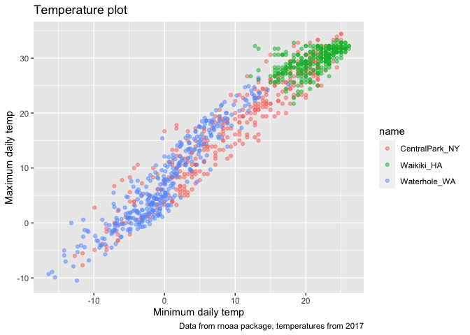
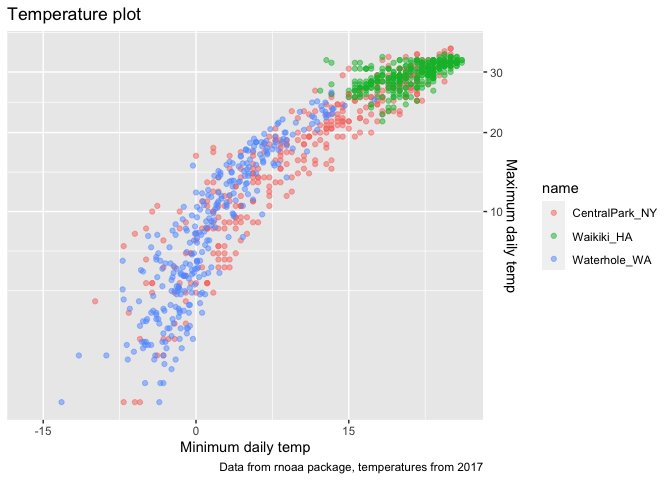
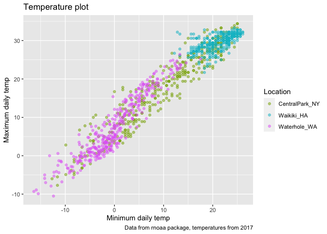
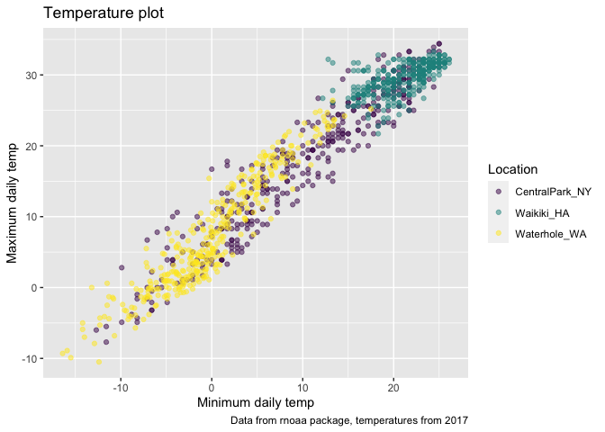
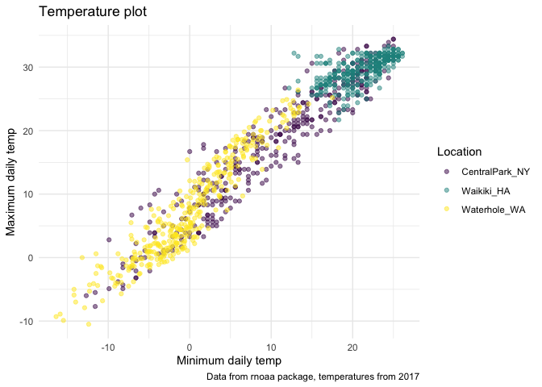
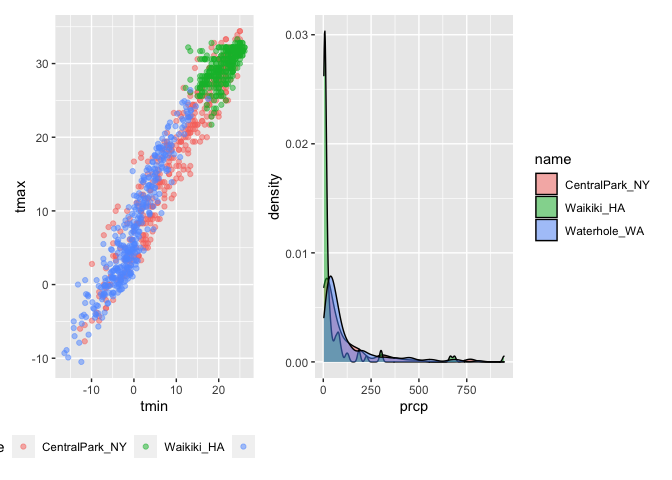
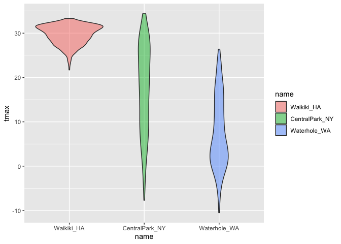

Visualization
================

``` r
library(tidyverse)
```

    ## ── Attaching packages ──────────────────────────────────────────────────────────────────────────── tidyverse 1.3.0 ──

    ## ✓ ggplot2 3.3.2     ✓ purrr   0.3.4
    ## ✓ tibble  3.0.3     ✓ dplyr   1.0.2
    ## ✓ tidyr   1.1.2     ✓ stringr 1.4.0
    ## ✓ readr   1.3.1     ✓ forcats 0.5.0

    ## ── Conflicts ─────────────────────────────────────────────────────────────────────────────── tidyverse_conflicts() ──
    ## x dplyr::filter() masks stats::filter()
    ## x dplyr::lag()    masks stats::lag()

``` r
library(patchwork)
```

## Load weather data

``` r
weather_df = 
  rnoaa::meteo_pull_monitors(
    c("USW00094728", "USC00519397", "USS0023B17S"),
    var = c("PRCP", "TMIN", "TMAX"), 
    date_min = "2017-01-01",
    date_max = "2017-12-31") %>%
  mutate(
    name = recode(
      id, 
      USW00094728 = "CentralPark_NY", 
      USC00519397 = "Waikiki_HA",
      USS0023B17S = "Waterhole_WA"),
    tmin = tmin / 10,
    tmax = tmax / 10) %>%
  select(name, id, everything())
```

    ## Registered S3 method overwritten by 'hoardr':
    ##   method           from
    ##   print.cache_info httr

    ## using cached file: /Users/megantebbenhoff/Library/Caches/R/noaa_ghcnd/USW00094728.dly

    ## date created (size, mb): 2020-10-05 15:37:03 (7.522)

    ## file min/max dates: 1869-01-01 / 2020-10-31

    ## using cached file: /Users/megantebbenhoff/Library/Caches/R/noaa_ghcnd/USC00519397.dly

    ## date created (size, mb): 2020-10-05 15:37:09 (1.699)

    ## file min/max dates: 1965-01-01 / 2020-03-31

    ## using cached file: /Users/megantebbenhoff/Library/Caches/R/noaa_ghcnd/USS0023B17S.dly

    ## date created (size, mb): 2020-10-05 15:37:11 (0.88)

    ## file min/max dates: 1999-09-01 / 2020-10-31

``` r
weather_df
```

    ## # A tibble: 1,095 x 6
    ##    name           id          date        prcp  tmax  tmin
    ##    <chr>          <chr>       <date>     <dbl> <dbl> <dbl>
    ##  1 CentralPark_NY USW00094728 2017-01-01     0   8.9   4.4
    ##  2 CentralPark_NY USW00094728 2017-01-02    53   5     2.8
    ##  3 CentralPark_NY USW00094728 2017-01-03   147   6.1   3.9
    ##  4 CentralPark_NY USW00094728 2017-01-04     0  11.1   1.1
    ##  5 CentralPark_NY USW00094728 2017-01-05     0   1.1  -2.7
    ##  6 CentralPark_NY USW00094728 2017-01-06    13   0.6  -3.8
    ##  7 CentralPark_NY USW00094728 2017-01-07    81  -3.2  -6.6
    ##  8 CentralPark_NY USW00094728 2017-01-08     0  -3.8  -8.8
    ##  9 CentralPark_NY USW00094728 2017-01-09     0  -4.9  -9.9
    ## 10 CentralPark_NY USW00094728 2017-01-10     0   7.8  -6  
    ## # … with 1,085 more rows

## Labels

``` r
weather_df %>% 
  ggplot(aes(x = tmin, y = tmax, color = name)) +
  geom_point(alpha = 0.5) +
  labs(
    title = "Temperature plot",
    x = "Minimum daily temp",
    y = "Maximum daily temp",
    caption = "Data from rnoaa package, temperatures from 2017"
  )
```

    ## Warning: Removed 15 rows containing missing values (geom_point).

<!-- -->

## Scales

``` r
weather_df %>% 
  ggplot(aes(x = tmin, y = tmax, color = name)) +
  geom_point(alpha = 0.5) +
  labs(
    title = "Temperature plot",
    x = "Minimum daily temp",
    y = "Maximum daily temp",
    caption = "Data from rnoaa package, temperatures from 2017"
  ) +
  scale_x_continuous(
    breaks = c(-15,0,15)
  ) +
  scale_y_continuous(
    trans = "sqrt",
    position = "right"
  )
```

    ## Warning in self$trans$transform(x): NaNs produced

    ## Warning: Transformation introduced infinite values in continuous y-axis

    ## Warning: Removed 90 rows containing missing values (geom_point).

<!-- --> Can use trans =
to transform, can do sqrt, log, and can use position to choose location
of Y-axis

#### Introducing scale\_color\_hue

``` r
weather_df %>% 
  ggplot(aes(x = tmin, y = tmax, color = name)) +
  geom_point(alpha = 0.5) +
  labs(
    title = "Temperature plot",
    x = "Minimum daily temp",
    y = "Maximum daily temp",
    caption = "Data from rnoaa package, temperatures from 2017"
  ) +
  scale_color_hue(
    name = "Location",
    h = c(100,300))
```

    ## Warning: Removed 15 rows containing missing values (geom_point).

<!-- --> name = in this
scale\_color\_hue function is the name of the legend, so we rename to
“Location”.

#### Introducing scale\_color\_viridis

``` r
weather_df %>% 
  ggplot(aes(x = tmin, y = tmax, color = name)) +
  geom_point(alpha = 0.5) +
  labs(
    title = "Temperature plot",
    x = "Minimum daily temp",
    y = "Maximum daily temp",
    caption = "Data from rnoaa package, temperatures from 2017"
  ) +
  viridis::scale_color_viridis(
    name = "Location",
    discrete = TRUE
  )
```

    ## Warning: Removed 15 rows containing missing values (geom_point).

<!-- --> Viridis is
better for those who are color blind, easier than creating our own color
scales (which Jeff does not recommend doing)

## Themes

#### Pre-defined themes exist and are useful/nice looking

``` r
weather_df %>% 
  ggplot(aes(x = tmin, y = tmax, color = name)) +
  geom_point(alpha = 0.5) +
  labs(
    title = "Temperature plot",
    x = "Minimum daily temp",
    y = "Maximum daily temp",
    caption = "Data from rnoaa package, temperatures from 2017"
  ) +
  viridis::scale_color_viridis(
    name = "Location",
    discrete = TRUE
  )+
  theme_minimal()
```

    ## Warning: Removed 15 rows containing missing values (geom_point).

<!-- --> Can use other
themes, but this removes the default aspects of the theme and use
theme\_minimal.

#### Can use the function theme() to do some of your own adjustments.

``` r
weather_df %>% 
  ggplot(aes(x = tmin, y = tmax, color = name)) +
  geom_point(alpha = 0.5) +
  labs(
    title = "Temperature plot",
    x = "Minimum daily temp",
    y = "Maximum daily temp",
    caption = "Data from rnoaa package, temperatures from 2017"
  ) +
  viridis::scale_color_viridis(
    name = "Location",
    discrete = TRUE
  ) +
  theme(legend.position = "bottom")
```

    ## Warning: Removed 15 rows containing missing values (geom_point).

<!-- -->

### Important to note: if you put a theme (example theme\_minimal) after you put another theme function (like changing the legend location), it will go to the default for the theme\_minimal. You need to include default theme types before you include the theme elements.

## Setting options that Jeff likes

``` r
library(tidyverse)

knitr::opts_chunk$set(
  fig.width = 6,
  fig.asp = .6,
  out.width = "90%"
)

theme_set(theme_minimal() + theme(legend.position = "bottom"))

options(
  ggplot2.continuous.colour = "viridis",
  ggplot2.continuous.fill = "viridis"
)

scale_colour_discrete = scale_colour_viridis_d
scale_fill_discrete = scale_fill_viridis_d
```

Will include at the top of all R markdown documents to keep formatting
the same for any plots created in any fuutre R markdown document.

## Data arguments in `geom`

``` r
central_park = 
  weather_df %>% 
  filter(name == "CentralPark_NY")

waikiki = 
  weather_df %>% 
  filter(name == "Waikiki_HA")

ggplot(data = waikiki, aes(x = date, y = tmax, color = name)) +
  geom_point() +
  geom_line(data = central_park)
```

    ## Warning: Removed 3 rows containing missing values (geom_point).

<!-- -->

## Time for patchwork

``` r
tmin_tmax_p = 
  weather_df %>% 
    ggplot(aes(x = tmin, y = tmax, color = name)) +
    geom_point(alpha = 0.5) +
    theme(legend.position = "bottom")

prcp_dens_p = 
  weather_df %>% 
  filter(prcp > 0) %>% 
  ggplot(aes(x = prcp, fill = name)) +
  geom_density(alpha = 0.5)

tmax_date_p = 
  weather_df %>% 
  ggplot(aes(x = date, y = tmax, color = name)) +
  geom_point() +
  geom_smooth() +
  theme(legend.position = "none")

tmin_tmax_p + prcp_dens_p
```

    ## Warning: Removed 15 rows containing missing values (geom_point).

<!-- --> Patchwork
displays when you name these plots and then use + or / to determine
positioning and inclusion of plots.

## Data manipulation

``` r
weather_df %>% 
  mutate(
    name = factor(name),
    name = forcats::fct_relevel(name, c("Waikiki_HA"))
  ) %>% 
  ggplot(aes(x = name, y = tmax, fill = name)) +
  geom_violin(alpha = 0.5)
```

    ## Warning: Removed 3 rows containing non-finite values (stat_ydensity).

<!-- -->

#### Getting densities for tmin and tmax overlaid.

``` r
weather_df %>% 
  pivot_longer(
    tmax:tmin,
    names_to = "observation",
    values_to = "temperatures"
  ) %>% 
  ggplot(aes(x = temperatures, fill = observation)) +
  geom_density(alpha = 0.5) +
  facet_grid(. ~ name)
```

    ## Warning: Removed 18 rows containing non-finite values (stat_density).

<!-- -->
